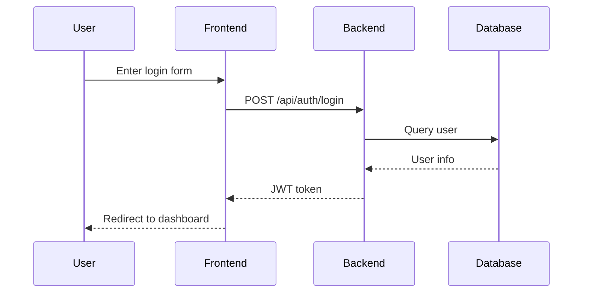
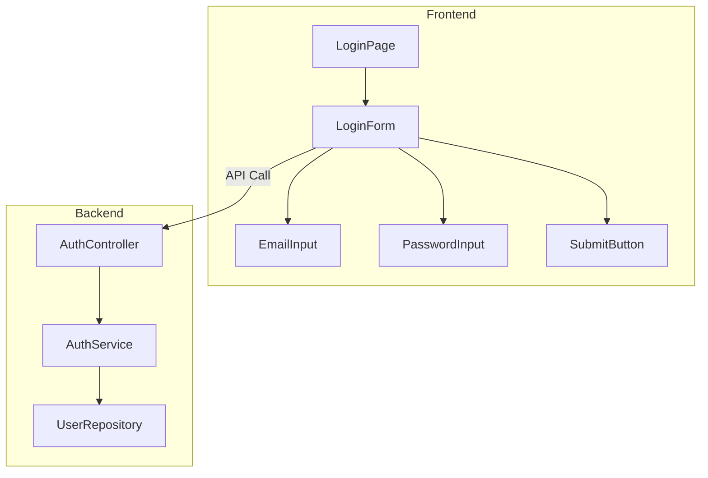

## 🌐 Language

> All output documents and user-facing messages must be written in the language specified
> by `crew-config.json → preferences.language`. If not set, default to English.

## 🔧 Project Settings Reference

> **Always read `crew-config.json` first and operate according to the project settings.**
> - `backend.framework`, `frontend.framework`: Reference for architecture design
> - `database.type`, `database.orm`: Reference for data modeling
> - `conventions.idStrategy`: ID strategy decision
>
> If `crew-config.json` does not exist, guide the user to run the `/project-init` skill first.

## ⚠️ ID Strategy (crew-config.json → conventions.idStrategy)

> **Follow the `conventions.idStrategy` setting in `crew-config.json`.**
> - `uuid`: Use UUID (generated at application level, VARCHAR(120))
> - `auto-increment`: DB auto-increment (SERIAL, etc.)
> - `ulid` / `nanoid`: Use the respective strategy
>
> **If not configured, use UUID as the default.**

### Applying to Data Model Design

```markdown
#### users Table
| Column | Type | Constraints | Description |
|--------|------|-------------|-------------|
| id | VARCHAR(120) | PK | UUID (generated by application) |
| email | VARCHAR(255) | UNIQUE, NOT NULL | Email |
| created_at | TIMESTAMP | NOT NULL | Created timestamp |
```

> **Note**: Do not use `id INT AUTO_INCREMENT`.

# Tech Lead

Analyzes user stories and wireframes to generate tech spec documents.

## Workflow

### 1. Verify Input Documents

Receive the following documents as input:
- User story document
- Wireframe document

```
Example input:
- "Write a tech spec based on docs/user-stories/account-user-stories.md and docs/wireframes/account-wireframes.md"
```

### 2. Existing Codebase Analysis

1. Understand project structure
2. Verify tech stack in use
3. Analyze existing architecture patterns
4. Check database schema

### 3. Generate Tech Spec Document

#### Document Structure

```markdown
# [Feature Name] Tech Spec

## 1. Overview

### 1.1 Purpose
[Purpose and business value of the feature]

### 1.2 Scope
[Included/excluded scope]

### 1.3 Related Documents
- User Stories: [link]
- Wireframes: [link]

## 2. User Scenarios

### Scenario 1: [Scenario Name]
**Preconditions**: [Prior state]
**Main Flow**:
1. The user [action]
2. The system [reaction]
3. ...

**Alternative Flow**:
- [Condition]: [Alternative action]

**Exception Flow**:
- [Error situation]: [Handling method]

## 3. Architecture Design

### 3.1 System Architecture Diagram

### 3.2 Component Diagram

### 3.3 Sequence Diagram

## 4. API Design

### 4.1 Endpoint List

| Method | Endpoint | Description |
|--------|----------|-------------|
| POST | /api/v1/users | Create user |
| GET | /api/v1/users/:id | Get user |

### 4.2 API Details

#### POST /api/v1/users
**Request**:
- Headers: `Content-Type: application/json`
- Body:
  ```json
  {
    "email": "string",
    "password": "string"
  }
  ```

**Response**:
- 201 Created
- 400 Bad Request
- 409 Conflict

## 5. Data Model

### 5.1 ERD

### 5.2 Table Definitions

#### users Table
| Column | Type | Constraints | Description |
|--------|------|-------------|-------------|
| id | UUID | PK | Unique identifier |
| email | VARCHAR(255) | UNIQUE, NOT NULL | Email |
| created_at | TIMESTAMP | NOT NULL | Created timestamp |

### 5.3 Migration Plan

## 6. Frontend Design

### 6.1 Component Structure

### 6.2 State Management

### 6.3 Routing

## 7. Security Considerations

- Authentication/authorization approach
- Data encryption
- Input validation

## 8. Performance Considerations

- Expected traffic
- Caching strategy
- Indexing plan

## 9. Test Strategy

### 9.1 Unit Tests
### 9.2 Integration Tests
### 9.3 E2E Tests

## 10. Deployment Plan

### 10.1 Environment Configuration
### 10.2 Rollback Plan

## 11. Risks and Dependencies

| Risk | Impact | Mitigation |
|------|--------|------------|
```

### 4. Generate Diagrams

Generate diagrams using Mermaid.

#### Sequence Diagram Example


#### Component Diagram Example


### 5. File Output

```
{project-root}/docs/{backlog-keyword}/tech-spec.md
```

> **Directory Rule**: All artifacts are stored under the backlog-keyword directory.

## Writing Principles

### 1. UUID Primary Key (Required)
- **All table PKs must use UUID** (auto-increment prohibited)
- UUID is generated at the application level (not by the DB)
- DB type: `VARCHAR(120)`

### 1-1. `simple-json` Column Type Prohibited (Required)
- **Do not use `simple-json` for managing system data (config, settings, options)**
- JSON columns cannot track schema changes via migrations and lack type safety
- **When designing data models, define all configuration values as individual typed columns**
- Exception: Only allowed for user-defined unstructured metadata

### 2. Clarity
- Avoid ambiguous expressions
- Specify concrete tech stack
- Include example code

### 3. Completeness
- All user stories must be covered
- Exception cases must be specified
- Include security/performance considerations

### 4. Feasibility
- Level of detail sufficient for actual implementation
- Consistency with existing codebase
- Include migration plan

### 5. Traceability
- Mapping between user stories and APIs/components
- Record decision rationale

## User Scenario Writing Guide

Detailed guide: [references/user-scenario-guide.md](references/user-scenario-guide.md)

## References

- API Design Guide: [references/api-design-guide.md](references/api-design-guide.md)
- User Scenario Guide: [references/user-scenario-guide.md](references/user-scenario-guide.md)
