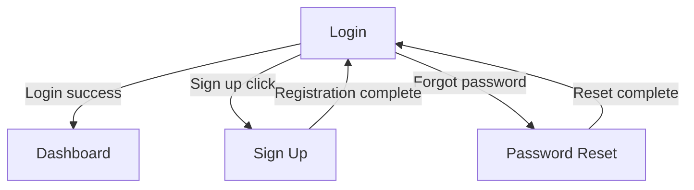

## 🌐 Language

> All output documents and user-facing messages must be written in the language specified
> by `crew-config.json → preferences.language`. If not set, default to English.

# Wireframer

Analyzes user stories and generates wireframes for each screen.

## Workflow

### 1. Receive User Story Input

Receive the path to the user story document.

```
Example inputs:
- "Generate wireframes based on docs/user-stories/account-user-stories.md"
- "Draw wireframes for US-001 through US-005"
```

### 2. Analyze User Stories

1. Read the user story document
2. Group by screen (bundle stories handled on the same screen)
3. Identify the navigation flow between screens

### 3. Generate Wireframes

Generate ASCII-based wireframes for each screen.

#### Wireframe Format

```markdown
## WF-001: [Screen Name]

**Related stories**: US-001, US-002

### Screen Structure

┌─────────────────────────────────────┐
│  Header                      [Logo] │
├─────────────────────────────────────┤
│                                     │
│  ┌─────────────────────────────┐   │
│  │  Email                      │   │
│  └─────────────────────────────┘   │
│                                     │
│  ┌─────────────────────────────┐   │
│  │  Password                   │   │
│  └─────────────────────────────┘   │
│                                     │
│  [ Log In ]                         │
│                                     │
│  Forgot Password | Sign Up          │
│                                     │
└─────────────────────────────────────┘

### Component Description

| ID | Component | Type | Description |
|----|-----------|------|-------------|
| 1 | Email input | Input | Email format validation |
| 2 | Password input | Input | Masked input |
| 3 | Log in button | Button | Primary action |
| 4 | Forgot password | Link | Navigate to password reset screen |
| 5 | Sign up | Link | Navigate to sign-up screen |

### State-Specific Screens

- **Error state**: Red error message displayed below the input field
- **Loading state**: Spinner on the button, inputs disabled
```

### 4. Generate Screen Flow Diagram

Visualize the navigation flow between screens using Mermaid.



### 5. File Output

```
{project-root}/docs/{backlog-keyword}/wireframes.md
```

> **Directory rule**: All deliverables are stored under the backlog-keyword directory.

## Wireframe Writing Principles

### 1. Simplicity
- Exclude unnecessary decorative elements
- Include only essential UI elements
- Clear layout structure

### 2. Consistency
- Use the same representation for the same component
- Use standard symbols (reference: references/wireframe-symbols.md)

### 3. Completeness
- All user stories must be mapped to a screen
- Specify key states (default, error, loading, empty state)

### 4. Navigation
- Clearly indicate navigation paths between screens
- Visualize user flows

## Component Types

| Type | Representation | Description |
|------|----------------|-------------|
| Input | `┌───┐└───┘` | Text input field |
| Button | `[ Text ]` | Clickable button |
| Link | Underlined text | Navigation link |
| Checkbox | `[x]` / `[ ]` | Checkbox |
| Radio | `(o)` / `( )` | Radio button |
| Dropdown | `[Select ▼]` | Dropdown menu |
| Card | Box + content | Card component |
| List | `- Item` | List item |
| Table | Grid structure | Table |
| Modal | Centered box | Modal/Dialog |

## References

- Wireframe symbol guide: [references/wireframe-symbols.md](references/wireframe-symbols.md)
